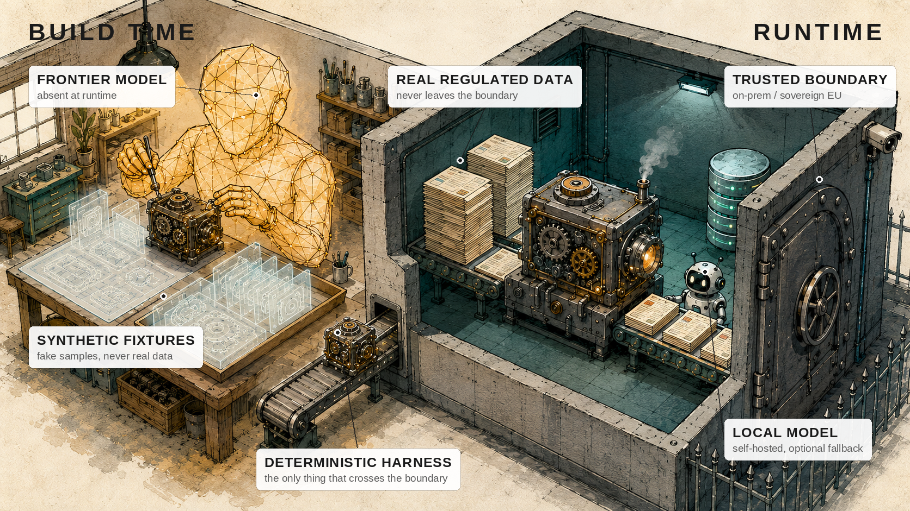

# Amber

<p align="center">
  
</p>

<p align="center">
  <em><strong>Amber lets a powerful AI design your data-processing tool without ever seeing your data — you ship the tool, not the AI.</strong></em>
</p>

Using a frontier model to write code is not new. What Amber adds is a **precise
language** for the separation — one that names what AI is allowed to do in *both*
places it appears, not just where it writes the code:

- **The Forge** — the untrusted build environment. The frontier model works here,
  from your spec and synthetic data. It never sees real data, and it is gone before
  runtime.
- **The Machine** — the finished, deterministic tool built in the Forge. Plain,
  readable, frozen code. This is what you ship — not the AI.
- **The Enclave** — your trusted runtime. The Machine runs here on real data, with
  no frontier model present and no assumption of internet access.
- **Trusted AI** — an optional model *you* host inside the Enclave, in a defined,
  bounded role (Judge or Capability). The only AI allowed near real data, and only
  on your terms.

Full definitions in the [glossary](docs/glossary.md).

---

## The bind

A frontier model can design how your data should be processed better than most
teams can do it by hand. Give it the shape of a problem — records to classify,
fields to extract, text to redact, anomalies to flag — and it will design
processing that is more accurate, more complete, and more robust than the rules a
team would write under deadline.

For regulated data, you cannot use that capability the obvious way. Banking
records, patient files, anything under GDPR — you cannot hand it to a US or
Chinese cloud model. The constraint is not about encryption. A TLS connection to
a foreign cloud is still disclosure to a foreign cloud; the data has left your
trust boundary the moment it is processed there. The trust boundary is about
*where processing happens*, not whether the link in transit is encrypted.

So regulated teams are left with a bad choice. Either forgo frontier-quality
processing entirely and build weaker logic in-house, by hand, at the level of
capability your own team can muster — or stand up and serve a capable model
yourself, paying for the infrastructure and the operational risk, and still
getting weaker results than the frontier. Neither option gives you frontier
capability on data you are not allowed to disclose.

Amber removes the choice.

## The inversion

Amber forms when resin from a living tree flows around something and then hardens.
The organism is gone, but its form is preserved with perfect fidelity — frozen,
permanent, and clear enough to study millions of years later. The insect is
absent from the amber that holds its shape.

Amber, the method, inverts the usual arrangement between a model and your data.
The usual arrangement sends your data to the model at the moment of processing.
Amber never does. The model works *only at build time* — on the structure of your
problem, and on synthetic data manufactured to stand in for the real thing. From
that, and only that, it produces a finished tool.

Then it sets.

What you deploy is a hard, deterministic machine. It runs inside your own trusted
environment, against your real data, with no model in the loop. The capability is
preserved in the machine; the model that produced it is absent by construction —
the insect, gone from the amber that holds its shape. The thing with the capability
and the thing with the data are separated in time, and they never meet.

## Three properties

Three properties come straight out of the metaphor, and each answers a question a
regulated-industry buyer actually asks.

### Frozen — *does it drift?*

The machine's behavior is fixed at build time. It does not retrain, does not
update itself, does not call home. The engine and policy are frozen: the
deterministic path is bit-reproducible, so the same input yields the same output,
every time, on the day you deploy it and a year later. There is no model in the
runtime to drift, no silent version bump from a vendor, no behavior that changes
underneath you. What you tested is what runs. What you audited stays audited.

Determinism is a spectrum, and the method is honest about it. Deterministic code
is fully reproducible; a trusted model is not — a model swap or a quantization
change can move its verdict. So the load-bearing rule: **a trusted-model verdict
can never silently change a deterministic outcome.** If no model is reachable the
judgment skips cleanly rather than fails, and verdicts are advisory and receipted
(see Transparent), never silent gates.

### Transparent — *can I audit it?*

Amber is clear. What Amber produces is readable, auditable code — not an opaque
model whose behavior you can only sample and hope. You can hold the machine to
the light and see exactly what it does: the logic, the branches, the handling of
each case. This is what an auditor needs, and increasingly what regulation
demands. Under regimes like NIS2 and the Cyber Resilience Act, accountability is
personal and specific; the person who signs needs to be able to see, and show,
what the system does. You cannot do that with a model. You can do it with the
machine Amber leaves behind.

Transparency only gets teeth when you say *who audits what, how often.* Engineers
audit the engine once; a domain expert re-reads the small policy every cycle. And
where the machine uses a trusted model, transparency is a **runtime output
obligation**: each call emits a receipt — verdict, one-line reason, model and
version — as durable output an auditor can read after the fact. Readable code
around a model is still a black box unless the model explains itself in what it
emits.

### Sealed — *where does my data go?*

Your real data flows through the machine and never to the model that designed it. The
capability and the data are separated in time and never meet. This is the
load-bearing guarantee, and it does not rest on a promise. It rests on the fact
that the frontier model is simply not present on the runtime data path. There is
nothing to trust, because there is nothing there. A "we don't train on your data"
assurance is a promise; Sealed is a property of the architecture.

Sealed is really two guarantees, and honesty requires separating them. The
**runtime seal is structural** — the frontier model is not on the data path. The
**build-time non-disclosure** — that the model saw only the spec and synthetic
fixtures, never real data — is, in a naive build, enforced by discipline rather
than architecture: nothing mechanically stops someone from feeding real data in at
build time. The method's aim is to make it checkable too: the build provably sees
only spec + fixtures, and the machine has no network egress except its one declared
local endpoint. Until then, the runtime seal is a property; the build-time seal is
a procedure — don't blur the two.

## How it works

The two phases never overlap: the frontier model builds the machine in the Forge
from spec and synthetic fixtures, then it is gone; the machine runs in the Enclave
on real data, never given an address to call the frontier model because the
architecture gives it none.

Most of what the machine does is fixable logic — rules, transforms, decisions that
can be written down once and frozen — and runs as plain deterministic code. Where a
task genuinely needs judgment that cannot be reduced to fixed logic, the machine
calls a **self-hosted trusted model, inside the Enclave**, on data that never
leaves. The execution ladder is: deterministic code first; a trusted model only
where it is needed; the frontier model never. Each rung keeps Sealed true.

This is the one place a model runs at runtime, and it is where the real engineering
friction lives — nondeterministic output, reasoning models that ignore the output
format, token budgets, graceful degradation — and where "inside the boundary" has
to be made operational. Its contract and a reference adapter are specified in
[docs/tier-2-contract.md](docs/tier-2-contract.md).

## What you bring

You do not need to write code to use Amber. You bring a *spec* — the shape of the
work: what comes in, what must come out, which cases are hard, which mistakes are
unacceptable — and *synthetic fixtures* that carry that structure and its edge
cases without carrying anything real. Because the fixtures are synthetic the build
discloses nothing; because they are faithful to the structure, the machine that
results is faithful to your real work.

## Where it breaks

Amber is not a universal solvent, and the honest line matters more than the
pitch.

**The boundary.** Amber fits problems whose *judgment can be fixed at build time*.
If a task requires open-ended frontier reasoning on live data — reasoning that
cannot be reduced to deterministic logic and is beyond what a self-hosted trusted
model can do — then it is out of scope for Amber. There is no trick that lets you
have frontier reasoning on the real data at runtime without disclosing the real
data at runtime. Amber does not pretend otherwise. That is the line.

**The texture.** In practice the line cuts through the middle of most real
pipelines, not around them. A pipeline is rarely one monolithic act of judgment;
it is mostly fixable logic with a few genuinely hard spots. Amber freezes
everything it can into deterministic code and lets a trusted model cover the
residue. The residue shrinks; it does not always vanish.

**The fork.** When a trusted model covers the residue, you must decide *what its
verdict is allowed to do*: act autonomously, or produce only a receipted flag a
human adjudicates. This is an explicit design choice — and for an audit posture the
flag-for-a-human option is usually right, keeping every consequential decision with
an accountable person while still capturing the model's reasoning.

**The move.** So part of the method is decomposition — designing the problem so
that the frozen machine plus a trusted model covers it, isolating the parts that
truly need judgment from the parts that only looked like they did. A problem that
cannot be decomposed this way is not an Amber problem, and you will know early.

The two tiers must be genuinely complementary, or the trusted model is decoration.
If everything it catches a deterministic rule could also catch, you do not need it.
So validating a machine includes a required step: show at least one case that
passes every deterministic check and is resolved only by the model's judgment. If
you cannot construct that case, the judgment tier is not earning its place.

**Verifying the seal.** Because the machine is transparent code running in your
own environment, you do not have to take the seal on faith. You can inspect the
machine and confirm what it talks to. The absence of the frontier model on the
data path is a thing you can check, not a thing you are told.

**The receipt.** "Frozen" is not verifiable until you can prove what the machine
*is.* So an Amber build emits a manifest: content hashes of the engine, the policy,
and the originating spec, plus pinned dependency versions — and, deliberately, no
timestamp, so two builds of the same inputs are byte-identical and diffable. The
manifest is what turns Frozen and Transparent from claims into things an auditor
checks with `diff`: same hashes, same machine; a changed policy shows up as a
changed hash and nothing else moves.

## Using the skill

This repository is a Claude Code **plugin marketplace**, so the skill installs
straight from its GitHub URL. The skill itself lives at `skills/amber/` — a
`SKILL.md` build procedure plus the glossary and the tier-2 contract it loads on
demand. However you install it, the skill fires when you ask the agent to build a
Machine and walks it through the gates: decomposition, deterministic-first
construction, the Trusted AI contract where a residue needs it, the manifest, and
the seal report.

### Install

**Claude Code, from GitHub (recommended).** Add this repo as a marketplace and
install the plugin:

```
/plugin marketplace add rebaze/amber
/plugin install amber@amber
```

The skill then triggers on its own when you ask for a Machine, or you can invoke it
explicitly as `/amber:amber`. (`amber@amber` is `plugin@marketplace` — both are
named `amber` here.)

**Any filesystem-based agent (Claude Code or the Agent SDK), manually.** Symlink the
skill folder into a skills directory the agent scans — `~/.claude/skills/` for every
project, or a project's `.claude/skills/`:

```sh
git clone https://github.com/rebaze/amber
ln -s "$PWD/amber/skills/amber" ~/.claude/skills/amber
```

A symlink beats a copy here: `git pull` in the clone then updates the installed
skill with nothing further to do.

**Claude API.** The API installs skills as an uploaded bundle rather than from the
filesystem. Zip the folder and upload it via the `/v1/skills` endpoint:

```sh
cd skills && zip -r amber.skill amber -x 'amber/evals/*'
```

`amber.skill` is a build artifact (git-ignored), rebuilt from the folder whenever
you need it.

### Update

A skill is just files read fresh each session, so an update is only ever an
overwrite.

- **Plugin install** — pull the latest and reload (a restart applies it):

  ```
  /plugin marketplace update amber
  /plugin update amber
  ```

- **Symlink install** — `git pull` in the clone; the next session reads it.

- **API bundle** — rebuild `amber.skill` and re-upload it.

To confirm an update took, open a fresh session and ask the agent to build a
Machine — it should follow the current gates.

## What it changes

Amber separates the two things the usual arrangement conflates: the capability that
designs the processing, and the data the processing runs on. Keep them apart in
time and you can have frontier-designed quality on data you are never allowed to
disclose — with a guarantee that is structural rather than promised, and at a cost
closer to running your own code than to serving your own model.

The model that designs your data processing never sees your data. That is the
whole idea, and everything else follows from it.
